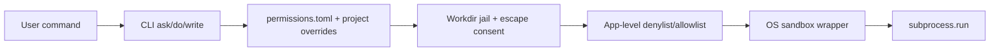
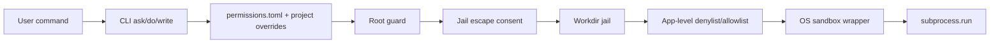

# tlm 0.2.0-beta prep

Linux stays first-class in 0.2.0 (per `Describe_Here.md`), but packaging scaffolding lands now so macOS/Windows can be flipped on in 0.3.0 without churn. Version jumps from `0.1.0.dev0` to `0.2.0b1` (PEP 440 beta).

## 1) Version, release train, CI

- Bump `[project].version` in [pyproject.toml](pyproject.toml) to `0.2.0b1`; update [VERSION](VERSION) header comments.
- Add [CHANGELOG.md](CHANGELOG.md) with `0.2.0b1` section (Keep-a-Changelog style).
- Extend [.github/workflows/ci.yml](.github/workflows/ci.yml): add `pip-audit` + `mypy src/tlm` (soft-fail matrix entry) in addition to existing ruff+pytest.
- New [.github/workflows/release.yml](.github/workflows/release.yml) triggered on `v0.2.*` tag: build wheel, sdist, `tlm.pyz` zipapp, SHA256SUMS, and attach to a draft GitHub Release.

## 2) Easy installer (staged, all three tiers)

Stage A — pipx installer script (ships in 0.2.0b1):

- New [scripts/install.sh](scripts/install.sh) (POSIX, bash) — detects `pipx`, falls back to `python3 -m venv ~/.local/share/tlm-venv && ln -sf .../bin/tlm ~/.local/bin/tlm`, verifies `~/.local/bin` on `PATH`, pins the version tag.
- New [scripts/install.ps1](scripts/install.ps1) — Windows placeholder so the one-liner pattern is documented but guarded behind `--experimental`.
- `README.md` install section: replace the manual venv block with three options: `curl -fsSL .../install.sh | bash` (with SHA verify step shown), `pipx install tlm==0.2.0b1`, or `pip install tlm==0.2.0b1`.
- Note: our own [src/tlm/safety/shell.py](src/tlm/safety/shell.py) denylist blocks `curl ... | sh`; document the pattern but *strongly* recommend the verified SHA path.

Stage B — single-file zipapp (ships in 0.2.0b1):

- Add `shiv` as a build-time dep (build-only, not runtime).
- New [packaging/build_zipapp.sh](packaging/build_zipapp.sh): `shiv -c tlm -o dist/tlm.pyz -p '/usr/bin/env python3' .` produces a self-contained artifact.
- Release workflow publishes `tlm.pyz` + `tlm.pyz.sha256` as release assets.

Stage C — native packages (Linux now, others scaffolded for 0.3.0):

- [packaging/linux/deb/](packaging/linux/deb/) with `stdeb.cfg` + a tiny Makefile target; build optional in release workflow.
- [packaging/linux/aur/PKGBUILD](packaging/linux/aur/PKGBUILD) tracking GitHub tags.
- Placeholders only (activate in 0.3.0): [packaging/macos/homebrew/Formula/tlm.rb](packaging/macos/homebrew/Formula/tlm.rb), [packaging/windows/scoop/tlm.json](packaging/windows/scoop/tlm.json), [packaging/windows/winget/manifest.yaml](packaging/windows/winget/manifest.yaml).

## 3) Sandbox + access control (app-level + OS sandbox + workdir jail)

Three layers wired together; GUI drives them.

High-level flow (detailed flow with freelist, root guard, and escape consent is in §3a–§3c):




New [src/tlm/safety/permissions.py](src/tlm/safety/permissions.py):

- Loads `$XDG_CONFIG_HOME/tlm/permissions.toml`:
  - `[global]` `network_mode = "off|ask|on"`, `sandbox_engine = "auto|bwrap|firejail|off"`.
  - `[global.allow_paths]` (RW, no prompt), `[global.read_paths]` (RO, no prompt), `[global.deny_paths]` (always blocked, beats everything except root-guard which is stricter).
  - `[global.allow_commands]`, `[global.deny_commands]`.
  - `[[project]]` overrides keyed by absolute path or git-repo root hash, with the same path/command fields.
  - `[escape_grants]` managed list of paths the user clicked `persist` on from the consent prompt — same effect as `allow_paths` but clearly labelled so they can be reviewed/revoked in the GUI.
- Resolves the effective policy for a given `cwd`:
  1. Start from `[global]`.
  2. Apply the matching `[[project]]` override (first match wins; project_root inferred from git toplevel, else `cwd`).
  3. Append `[escape_grants]` into the effective `allow_paths`.

New [src/tlm/safety/jail.py](src/tlm/safety/jail.py):

- Path classification via `classify_path(path, policy) -> {"free_rw"|"free_ro"|"jail"|"escape"|"denied"}`:
  - `realpath` first (defeats symlink escapes).
  - `denied` if under any `deny_paths` → hard block, no prompt.
  - `free_rw` if under `allow_paths` or `escape_grants` → proceed silently.
  - `free_ro` if under `read_paths` and the op is read-only → proceed silently; RW attempt on a RO-free path falls through to `escape`.
  - `jail` if under the current workdir jail → proceed silently.
  - else `escape` → triggers the consent prompt from §3a.
- `resolve_jailed_path(path, policy, *, op)` wraps the classifier; `op` is `"read"` or `"write"`.
- Used by [src/tlm/modes/write.py](src/tlm/modes/write.py) before atomic-write (`op="write"`) and by [src/tlm/modes/do.py](src/tlm/modes/do.py) on each argv's resolved `cwd` plus best-effort path-looking tokens (`/`-prefixed, `~`-expanded, `--out=/…`); arg-level classification is conservative — anything ambiguous is classified as `escape` rather than `jail` so the user gets a prompt instead of a silent pass.

### 3a) Pre-approved folder freelist (no-consent zone)

The whole point: users pre-declare folders tlm can touch silently, and everything else triggers the consent prompt (§3b). Two tiers:

- `allow_paths` — RW. Writes, creates, deletes, and exec `cwd` here proceed without a prompt.
- `read_paths` — RO. Reads and listings proceed silently; any write attempt here falls through to the escape consent prompt (you're telling tlm "you may look, but ask before changing").

Resolution rules (all evaluated against `os.path.realpath`):

- Entries may be absolute (`/home/me/projects`) or `~`-prefixed.
- Entries are prefix matches on the resolved path; `/home/me/proj` covers `/home/me/proj/sub/file`.
- Order of precedence: `deny_paths` > root-guard system roots > `allow_paths`/`escape_grants` > `read_paths` > workdir jail > everything else (escape prompt).
- Symlinks that resolve outside a freelisted folder do **not** inherit freelist status — the realpath check is the only thing that matters.
- `$HOME`, `/`, and any path containing only trivial segments (e.g. just `/home`) are rejected at load time with a clear error, to prevent accidentally granting the world.

CLI surface (new subcommand group on [src/tlm/cli.py](src/tlm/cli.py)):

- `tlm paths` — list effective freelist (global + project override + persisted escape grants), with a column showing the source of each entry.
- `tlm allow <path> [--read-only] [--project]` — add to `allow_paths` (or `read_paths` with `--read-only`); `--project` scopes to the current project instead of global.
- `tlm unallow <path> [--project]` — remove from any of the three lists.
- All of these just edit `permissions.toml` with the same 0o600 mode enforcement used by [src/tlm/settings.py](src/tlm/settings.py).

GUI surface — the Permissions tab (§3 above) treats the freelist as its primary widget:

- Two side-by-side lists: "Free (read & write)" and "Free (read only)", each with Add/Browse/Remove.
- Per-project tab so a project-scoped freelist is one click away from the global one.
- Separate labelled list for `Persisted escape grants` (entries that came from the consent `persist` option), so those can be audited and revoked without touching the user-curated freelist.

### 3b) Jail-escape consent prompt (new)

When a `write`/`do` plan references a path outside the jail, do **not** silently block — surface it and ask:

```text
tlm: the following paths fall OUTSIDE the sandbox
  RW  /etc/hosts
  R   /var/log/syslog
grant access? [N/once/session/persist/cancel]
  once     — this one plan only
  session  — until this shell exits (memory only)
  persist  — append to permissions.toml (will show the exact toml diff first)
  N        — refuse (default)
```

- Implemented in new [src/tlm/safety/consent.py](src/tlm/safety/consent.py); reused by both modes through the existing [src/tlm/safety/gate.py](src/tlm/safety/gate.py) flow.
- `--yes` / `auto_yes` **never** auto-grants escapes; escapes always require interactive consent regardless of profile, and they never promote to `persist` without an explicit second confirmation.
- `strict` profile: escape-prompt shows but only offers `once` / `cancel` (no session/persist).
- `trusted` profile: all four options available.
- Non-TTY runs (e.g. piped input) treat an escape request as an automatic refusal with a clear error.

### 3c) Root-access guard (new, very cautious)

Root is treated as the highest-risk path and gets its own layer in front of the sandbox. Implemented in new [src/tlm/safety/root_guard.py](src/tlm/safety/root_guard.py):

- Detect elevation in argv: `sudo`, `doas`, `su`, `pkexec`, `runuser`, `machinectl shell`, `systemd-run --uid=0`, and any argv where `argv[0]` resolves to a setuid binary (best-effort `os.stat` check).
- Detect effective root at process start (`os.geteuid() == 0`) — print a loud banner and refuse to enable `trusted` profile while euid is 0.
- Detect writes to system roots from `write` / jail-escape prompt: `/etc`, `/boot`, `/usr`, `/opt`, `/var`, `/sys`, `/proc`, `/lib`, `/lib64`, `/root`, `/srv`, `/dev`.
- Policy by profile:
  - `strict` — hard block; message explains how to rerun outside tlm if truly needed.
  - `standard` — hard block; prompt offers only `cancel` (no escape).
  - `trusted` — prompt requires the user to **type the exact phrase** `I accept root risk` (case-sensitive) before the plan can proceed; still logs the event with argv + cwd to the request log (redacted for secrets).
- `tlm do` additionally refuses any argv whose elevation tool is present even when the subcommand itself looks read-only (a read-only `sudo cat /etc/shadow` is still root access).
- GUI `Permissions` tab surfaces a `Root policy` row (read-only status: "blocked in strict/standard, phrase-gated in trusted") so users see the rule instead of it being hidden logic.

These two layers run **before** the OS sandbox wrapper and the app-level denylist, so a block decision short-circuits the rest.

Updated flow:



New [src/tlm/safety/sandbox.py](src/tlm/safety/sandbox.py):

- Detects `bwrap` / `firejail` via `shutil.which`.
- Builds a wrapper argv for `do` mode, e.g.:

```python
def wrap_argv(argv, *, cwd, policy):
    if policy.sandbox == "bwrap" and shutil.which("bwrap"):
        base = ["bwrap", "--ro-bind", "/", "/", "--bind", str(cwd), str(cwd),
                "--dev", "/dev", "--proc", "/proc", "--unshare-user", "--die-with-parent"]
        if policy.network == "off":
            base.append("--unshare-net")
        return [*base, "--", *argv]
    ...
```

- Falls back to app-level only if no engine is present.
- `tlm do` path ([src/tlm/modes/do.py](src/tlm/modes/do.py)) calls `wrap_argv(...)` just before `subprocess.run(...)`; writes still use `jail.resolve_jailed_path`.

Extend [src/tlm/safety/profiles.py](src/tlm/safety/profiles.py):

- `strict` now implies `sandbox_engine=auto`, `network_mode=off`, jail on.
- `standard` → sandbox auto, network ask, jail on.
- `trusted` → sandbox off, network on, jail off (documented risk).

GUI — [src/tlm/gui/app.py](src/tlm/gui/app.py) `Permissions` tab becomes a full editor:

- Engine selector (auto/bwrap/firejail/off with availability badges).
- Network mode radio.
- Two path lists (allow/deny) with Add/Remove/Browse.
- Two command lists (allow/deny).
- Per-project overrides table (current project first, quick-add button).
- Read-only `Root policy` row showing current profile's behavior (blocked / phrase-gated) and a warning banner if the GUI itself was launched as root.
- `Persisted escape grants` viewer: lists the `[escape_grants]` entries added via the consent prompt's `persist` option, with per-row Remove.

## 4) Security improvements

- Log redaction: [src/tlm/telemetry/log.py](src/tlm/telemetry/log.py) scrubs `api_key`, `authorization`, bearer tokens, and any env var ending in `_KEY|_TOKEN|_SECRET` before write; same filter reused in GUI log tail viewer.
- Config file mode check on startup (we already `chmod 0o600` on save in [src/tlm/settings.py](src/tlm/settings.py#L70-L73); add a warn-on-load if mode is looser than `0o600`).
- New command `tlm config migrate-keys` — moves keys out of `config.toml` into OS keyring (optional `keyring` dep added to a new `[project.optional-dependencies].secure` extra).
- `pip-audit` in CI (hard-fail on known CVEs in pinned deps).
- Release workflow generates a CycloneDX SBOM via `cyclonedx-py` and attaches to the Release.
- `tlm do` requires network-mode approval when the planned argv contains known network tools (`curl`, `wget`, `ssh`, `scp`, `nc`, `rsync`) — extend [src/tlm/safety/shell.py](src/tlm/safety/shell.py) denylist/allowlist rather than block-by-default.

## 5) Tests & docs

- New tests: `tests/test_permissions.py`, `tests/test_jail.py`, `tests/test_sandbox.py`, `tests/test_log_redaction.py`, `tests/test_root_guard.py`, `tests/test_escape_consent.py` (covers `--yes` never auto-grants escape, non-TTY refusal, root-phrase exact match, euid=0 trusted-profile block), `tests/test_freelist.py` (prefix matching, realpath, symlink escape, RO→RW fall-through, load-time rejection of `/` and `$HOME`, CLI `tlm allow/unallow/paths`).
- Update `tests/test_safety.py` to cover the new profile→sandbox mapping.
- Update docs: [README.md](README.md) install/security/sandbox sections, [docs/tlm.1](docs/tlm.1) flags and permissions file, [AGENTS.md](AGENTS.md) paths, [CODE_INDEX.md](CODE_INDEX.md) new files, [AGENT_PLAN.md](AGENT_PLAN.md) mark 0.2.0 items, [AGENT_TODO.md](AGENT_TODO.md) move to Done / push 0.3.0 items.

## Out of scope for 0.2.0b1 (deferred to 0.3.0)

- macOS `sandbox-exec` profile and Windows Job Object / AppContainer wrappers — scaffolded paths exist but not wired.
- Homebrew tap / Scoop / winget publishing pipelines — manifests are placeholders.
- `tlm ask --stream` (carries over from existing [AGENT_TODO.md](AGENT_TODO.md)).

