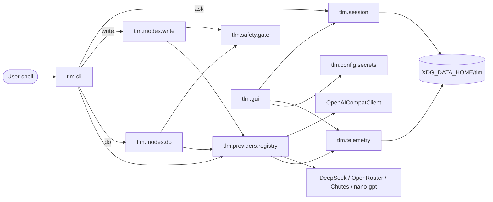

## Goal

Take `tlm` from the current scaffold (stub provider, `cli.py`, Tk skeleton, safety denylist) to a working Linux CLI that matches [Describe_Here.md](Describe_Here.md): `tlm ? …`, `tlm write …`, `tlm do …`, and `tlm gui`, with sessions, token/cost logging, and a Tk configuration UI — all destructive actions gated by the same preview+confirm flow.

## Architecture

## Phase 0 — Foundation cleanup (1 pass, small)

- Single source of version: read [VERSION](VERSION) in `tlm/__init__.py` (or drop `VERSION` and pin in `pyproject.toml` + expose `__version__`).
- Add `tlm/__init__.py` re-exports for `get_provider`, `Session`.
- Tighten [src/tlm/cli.py](src/tlm/cli.py): accept `-` / piped stdin (append to prompt when `sys.stdin` isn't a tty) so `journalctl -xe | tlm ? "why failing"` works.
- Add `--yes` (skip confirm, still print preview) and `--dry-run` flags (accepted on `write` / `do`; `--yes` is refused in `do` unless paired with allowlist profile, see Phase 3).
- Normalize error exits: 0 ok, 1 user-cancel, 2 usage, 3 provider/IO, 4 safety-block.

## Phase 1 — Real LLM providers

- New module `tlm/providers/openai_compat.py`: httpx client for OpenAI-style `/chat/completions`. Reused by OpenAI, DeepSeek, OpenRouter, Chutes, nano-gpt (each with its own `base_url` + default model).
- Extend `LLMProvider` in [src/tlm/providers/base.py](src/tlm/providers/base.py) with `stream(...)` (generator of tokens) and `count_tokens(text)`; default `count_tokens` = `len(text)//4` heuristic.
- Registry in [src/tlm/providers/registry.py](src/tlm/providers/registry.py) resolves `(provider_id, model)` from config → concrete client; keep `StubProvider` for tests.
- Config:
  - Env: `TLM_PROVIDER`, `TLM_MODEL`, `TLM_API_KEY`, `TLM_<PROVIDER>_API_KEY`, `TLM_<PROVIDER>_BASE_URL`.
  - File: `$XDG_CONFIG_HOME/tlm/config.toml` written by the GUI (provider, default model, per-provider model, timeout, temperature).
- Errors: map 401/403 → "key missing/invalid", 429 → "rate limited, retrying" (exponential backoff, max 3), others surface status + first 500 bytes of body.
- `tlm providers` subcommand: list ids + whether key is set + default model.

## Phase 2 — Sessions and context

- Extend [src/tlm/session.py](src/tlm/session.py) with `append_user/assistant`, `trim_to(max_tokens)` (keep system prompt + most recent turns), and `title_from_first_message(n=60)`.
- Build messages for provider: `[{"role":"system",...}, *sess.messages[-N:]]`, where `N` is clamped by a token budget (per-provider default from config).
- New CLI: `tlm sessions list|show ID|delete ID|rename ID "title"`.
- `tlm ask --session ID` already wired; add `--new` to force a new session, `--last` to resume most recent.
- GUI: Sessions tab — list by `updated`, open read-only transcript, delete; no message editing in v1.

## Phase 3 — Safety core and permissions

- Rename/expand [src/tlm/safety/shell.py](src/tlm/safety/shell.py) into `tlm/safety/`:
  - `gate.py` — single `approve(action: PreviewedAction, profile) -> Decision` used by both write and do.
  - `shell.py` — denylist (already in place), add: `sudo`/`su`, package-manager invocations without `--dry-run`, network installers (`curl|bash`, `wget|sh`), writes to `/etc`, `/boot`, `/sys`, `/proc`.
  - `profiles.py` — named profiles: `strict` (always prompt, deny destructive), `standard` (default), `trusted` (allow read-only commands without confirm, still preview).
- Preview object: list of argv OR list of file writes, estimated effect (reads/creates/modifies/deletes paths), reason string from LLM.
- Confirmation UX: show preview → `y` runs, `n` aborts, `e` opens `$EDITOR` to edit the action, `?` shows rationale. Same flow for CLI and GUI (GUI gets a modal).
- Logging: every approve/deny recorded via Phase 6 telemetry.

## Phase 4 — Write mode

- New module `tlm/modes/write.py`:
  - Prompt LLM with a JSON schema: `{ files: [{path, contents, executable}], notes }` (use function-calling when provider supports it, else regex-extract fenced JSON block).
  - Validate paths: no absolute paths outside `cwd` by default; reject symlinks crossing `cwd`; reject existing files without `--overwrite` unless diff is confirmed.
  - Preview: for each file show path + unified diff against existing (or "new file, N lines").
  - Apply: temp-file write + `os.replace` atomic rename; set exec bit when requested.
- CLI: `tlm write [--dir DIR] [--overwrite] [--dry-run] "prompt"`.

## Phase 5 — Do mode

- New module `tlm/modes/do.py`:
  - Prompt LLM with schema: `{ commands: [{argv, cwd?, env?, why}], dangerous: bool }`.
  - Run each command via `subprocess.run(argv, shell=False, cwd=..., env=..., timeout=T, capture_output=True)`; timeout default 60s, overridable.
  - After each command: show stdout/stderr, stop on non-zero unless `--continue-on-error`.
  - No secrets in env by default; explicit `--pass-env VAR`.
- CLI: `tlm do [--timeout S] [--cwd DIR] "ask"`.

## Phase 6 — Observability: logs, tokens, cost

- New `tlm/telemetry.py`:
  - JSONL request log at `$XDG_STATE_HOME/tlm/requests.jsonl` with `{ts, provider, model, session, in_tokens, out_tokens, ms, status, cost_usd}`.
  - Rolling rotation at 10MB (keep 3).
  - `tlm usage [--since 7d]` prints totals per provider/model.
- Token counting: real `tiktoken` for OpenAI-compatible models if installed (`tlm[usage]` extra), else heuristic.
- Cost: per-model price table in `tlm/telemetry/prices.py` (USD per 1K tokens in/out); unknown → `null`.
- GUI reads JSONL for the Usage tab (Phase 7).

## Phase 7 — Tk GUI

- Expand [src/tlm/gui/app.py](src/tlm/gui/app.py) with tabs:
  - **Keys**: per-provider masked entry, "test connection" button, write to `$XDG_CONFIG_HOME/tlm/config.toml` (optionally also system keyring if `keyring` is installed — fallback to file with `chmod 600`).
  - **Sessions**: list + read-only transcript (from Phase 2).
  - **Usage**: table per day + simple line chart (Tk `Canvas` hand-drawn to avoid matplotlib dep; upgrade later).
  - **Logs**: tail `requests.jsonl` with filter field.
  - **Permissions**: pick safety profile (Phase 3).
- GUI is read-your-config only; keys persist via the same config layer as CLI.

## Phase 8 — DX & packaging

- Shell completion: `tlm completion bash|zsh|fish` emits scripts (argparse-based, hand-rolled).
- Man page stub via `argparse-manpage` or generated file under `docs/tlm.1`.
- Distribution: keep `pip install -e .` for dev; publish to PyPI when providers land; `pipx` recommended in `Describe_Here.md`.
- Optional: AUR PKGBUILD (later).

## Phase 9 — Tests & CI

- Layout `tests/` with:
  - Unit: `safety/shell.py` denylist, `session` round-trip, `providers/registry` normalization, `modes/write.py` path validation.
  - CLI smoke via `subprocess.run(["tlm", "--help"])` and with `TLM_PROVIDER=stub`.
  - GUI: skip on CI without display (`pytest.importorskip` + `DISPLAY`).
- Dev deps already in `[project.optional-dependencies].dev` (`pytest`, `ruff`); add `mypy` optional.
- GitHub Actions workflow `.github/workflows/ci.yml`: matrix 3.11/3.12, ruff + pytest.

## Gaps in the current AGENT_PLAN.md (added above)

1. Streaming responses — not mentioned; added in Phase 1.
2. Model selection / per-provider model config — missing; added in Phase 1 + config file.
3. Persistent config file (`config.toml`) for the GUI to write — missing; added in Phase 1 and Phase 7.
4. Secure key storage (`keyring` fallback with `chmod 600`) — missing; added in Phase 7.
5. Token counting + cost table — current plan only says "token/cost estimates" in GUI; extracted to full Phase 6.
6. Structured output for write mode (JSON schema / function calling) + diff preview — missing; added in Phase 4.
7. Subprocess details (cwd, env scrubbing, timeouts, per-command stop) — only hinted; added in Phase 5.
8. Request log format, rotation, `tlm usage` command — missing; added in Phase 6.
9. Stdin piping and `--yes` / `--dry-run` flags — missing; added in Phase 0.
10. Safety profiles (`strict/standard/trusted`) + `e` edit-before-run in prompt — missing; added in Phase 3.
11. Shell completion + man page — missing; added in Phase 8.
12. Tests + CI — only bullet in [AGENT_TODO.md](AGENT_TODO.md); promoted to Phase 9.
13. Version single-source (`VERSION` vs `pyproject.toml` vs `__version`__) — already flagged in TODO; handled in Phase 0.
14. Session trimming by token budget — missing; added in Phase 2.
15. `tlm providers` / `tlm sessions` / `tlm usage` subcommands — missing; added in respective phases.

## Risks / open questions (for later, not blocking)

- Function-calling support varies: Chutes and nano-gpt may not expose it → fallback to fenced JSON.
- `keyring` on headless Linux often uses `SecretService` which needs a desktop session; default to `chmod 600` file and treat keyring as opt-in.
- Terminal rendering of markdown/code (`rich`) is a nice-to-have — deferred unless user wants it now.

## Suggested execution order (matches phases)

0 → 1 → 2 → 3 → 5 → 4 → 6 → 7 → 9 → 8. (Do mode before Write because its safety gate is simpler to validate end-to-end; both share Phase 3.)